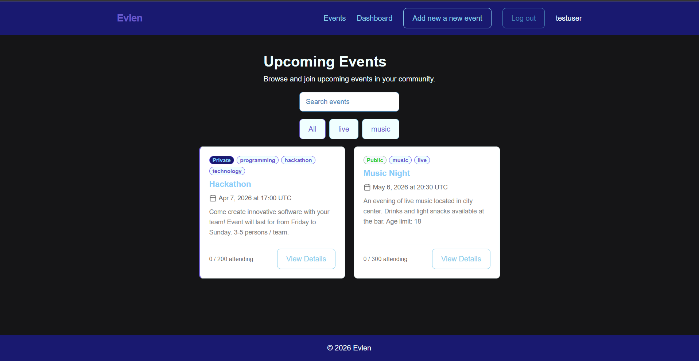
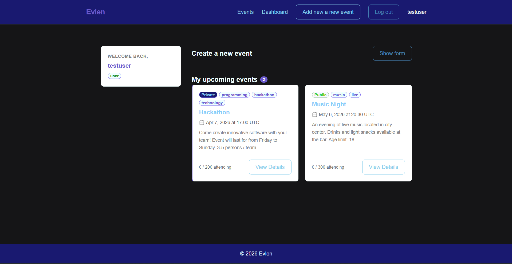
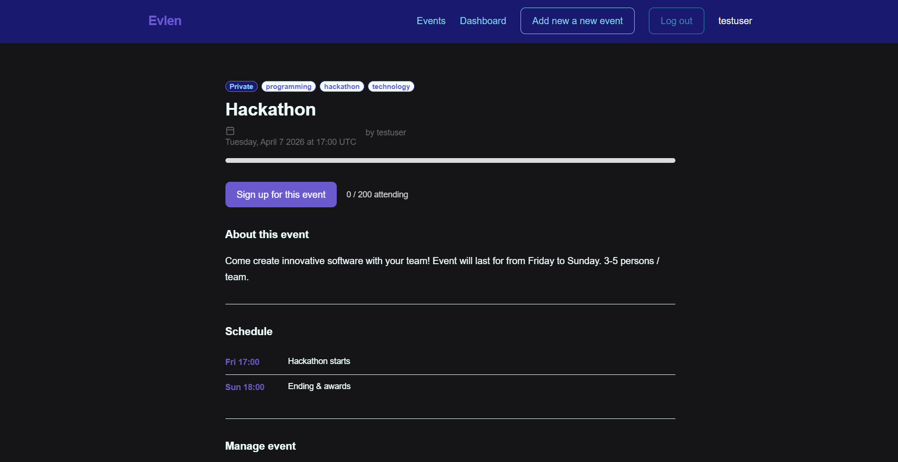

# Evlen

Evlen is a self-hosted event management application. You can create events, RSVP, and manage attendence.

---

## Screenshots





---

## Features

- Event listings: Users can browse events and click through to a full detail page
- RSVP system: One-click attend and withdraw with configurable max-attendee limit
- Public / private events: Toggle visibility per event
- Tag filtering & search: Filter the event list by category tag or text search
- Create, edit & delete: Event owners can manage their own events; admins can manage any event
- Automatic past-event cleanup: A background scheduler soft-deletes events one hours after they end
- Role system: User and admin roles; admins get full edit/delete rights across all events
- Toast notifications: Real-time feedback for all actions via HTMX

---

## Tech Stack

| Layer | Technology |
|---|---|
| Backend | Python, FastAPI, Uvicorn |
| Database | MongoDB 8 (with Motor async driver) |
| Templating | Jinja2 |
| Frontend | HTMX, CSS, JavaScript |
| Auth | JWT (PyJWT), bcrypt, HTTP-only cookies |
| Scheduling | APScheduler |
| Config | Pydantic Settings |
| Container | Docker, Docker Compose |

---

## Getting Started

< **This is the only section you need**. Clone the repo, and run one command. No local Python needed

### Prerequisities

| Operating system | Requirement |
|---|---|
| **Linux** | [Docker Engine](https://docs.docker.com/engine/install/) |
| **macOS** | [Docker Desktop](https://docs.docker.com/desktop/setup/install/mac-install/) |
| **Windows** | [Docker Desktop](https://docs.docker.com/desktop/setup/install/windows-install/) + [WSL (recommended)](https://learn.microsoft.com/en-us/windows/wsl/install) |

### 1. Clone the repository

```bash
git clone https://github.com/jjuh00/Evlen.git
cd evlen
```

### 2. Start the app with Docker

```bash
docker compose up --build
```

The application will be available at **[http://localhost:8000](http://localhost:8000)**  once both containers are healty

On subsequent starts you can drop `--build`:
```bash
docker compose up
```

To stop the app:
```bash
docker compose down
```

---

### Running with Docker Desktop (GUI)

If you prefer not to use the terminal after initial setup:

1. Clone the repo
2. Only during first startup: In `evlen/backend/` folder, run the following command in terminal
```bash
docker buildx build .
```
3. Open Docker Desktop
4. Find `evlen` stack under the Container tab
5. Use the play button to start and the stop button to stop the stack
6. Click the 8000:8000 port link to open the app in browser

> Admin creation (see below) still requires a terminal command

---

### Creating an Admin User

An admin account lets you edit and delete any event. There are two ways to create one:

While the containers are running:
```bash
docker compose exec app python create_admin.py
```

Without starting the full stack (useful for first-time setup):
```bash
docker compose run --rm --entrypoint "python create_admin.py" app
```

Both commands are interactive: you'll be prompted for an email, display name, and password. You can also run the command against an existing account's email to promote that user to admin

---

## Environment Variables

When the application starts, Python script checks if `.env` exists and has a valid `JWT_SECRET` value. If `.env` doesn't exist, it creates one from `.env.example` and generates a secure `JWT_SERCRET`

| Variable | Description |
|---|---|
| `JWT_SECRET` | Secret key used to sign JWT tokens |
| `JWT_ALGORITHM` | JWT signing algorithm (default: HS256) |
| `JWT_EXPIRE_MINUTES` | Token expiration time in minutes |
| `APP_ENV` | Application environment (development/production) |
| `MONGO_URL` | MongoDB connection string |
| `MONGO_DB` | MongoDB database name |

> `MONGO_URL` and `MONGO_DB` are also set directly in `docker-compose.yml` and will override whatever is in `.env` when running via Compose

---

## Project Structure

```
Evlen
│
├── docker-compose.yml
├── README.md
│
├── backend
│   ├── config.py
│   ├── create_admin.py
│   ├── database.py
│   ├── Dockerfile
│   ├── entrypoint.sh
│   ├── generate_secret.py
│   ├── main.py
│   ├── requirements.txt
│   ├── scheduler.py
│   │
│   ├── models
│   │   ├── event.py
│   │   └── user.py
│   │
│   ├── routers
│   │   ├── auth.py
│   │   ├── events.py
│   │   ├── pages.py
│   │   └── rsvp.py
│   │
│   └── utils
│       ├── authentication.py
│       └── helpers.py
│
└── frontend
    ├── templates
    │   ├── base.html
    │   ├── dashboard.html
    │   ├── event_new.html
    │   ├── event_page.html
    │   ├── index.html
    │   ├── login.html
    │   │
    │   └── partials
    │       ├── event_card.html
    │       ├── event_form.html
    │       ├── event_list.html
    │       ├── rsvp_button.html
    │       ├── schedule_item.html
    │       └── tag_filter.html
    │
    └── static
        ├── styles
        │   ├── animations.css
        │   ├── components.css
        │   ├── events.css
        │   ├── layout.css
        │   ├── login.css
        │   └── reset.css
        │
        └── scripts
            ├── events.js
            ├── login.js
            └── toast.js
```

---

## Future Improvements

Possible enhancements:
- Event image uploads
- Pagination for events

---

## Notes

- Data persistence: MongoDB data is stored in the `mongo_data` Docker volume. Running `docker compose down` doesn't delete it. To vipe all data, run `docker compose down -v`
- JWT secret rotation: Changing `JWT_SECRET` invalidates all existing sessions. All logged-in users will need to log in again
- Soft-deletes: Past events aren't immediately removed from the database: they're flagged `is_deleted: true` by the hourly scheduler job